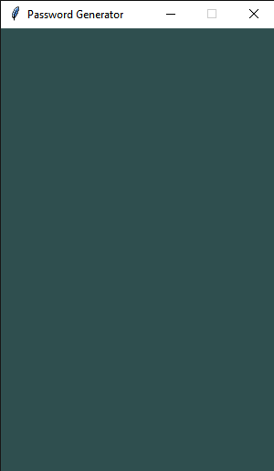
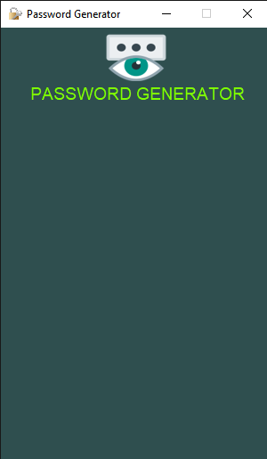
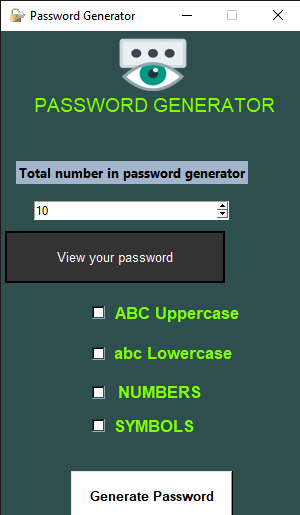

<br><br>
 
<a href="https://github.com/jokernets/password-generator">
</a>

<br><br>

## `Translation`🔗

<p align="center">
  
- [فارسی](Translation/FA.md)

- [عربية](Translation/AR.md)

</p>

Table of contents ✅✔
=================

<!--ts-->
   * [Installation](#installation)

   * [Anilayes Code📈](#anilayes-code)
     * [PART 1✔](#part-1this-code-sets-the-tkinter-window-for-the-password-generator-with-specific-dimensions-colors-and-position-on-the-screen-you-can-continue-to-build)
     * [PART 2✔](#part-2this-code-displays-a-logo-image-using-the-image-and-imagetk-packages-in-a-graphics-window-named-root-a-label-with-the-icon-password-generator-will-be-displayed-at-the-specified-point-in-the-window)
     * [PART 3✔](#part-3a-function-to-generate-a-random-password-in-python-this-function-uses-lowercase-letters-uppercase-letters-numbers-and-symbols-to-create-a-password-the-user-can-choose-which-characters-to-include-in-the-final-password-the-length-of-the-password-is-set-by-the-user-and-the-generated-password-is-displayed-in-the-app-also-there-is-a-button-to-copy-the-password-to-the-clipboard)
     * [PART 4✔](#part-4the-code-you-provided-is-part-of-a-simple-user-interface-for-a-random-password-generation-application-it-allows-users-to-choose-whether-to-include-uppercase-letters-lowercase-letters-numbers-and-symbols-in-the-password-users-can-also-specify-a-desired-password-length-once-the-password-is-created-it-can-be-copied-to-the-clipboard)
  
   * [Mor Example💯](#more-examples-and-showcase-)
     * [Picture Project🔆](#project-image)
     * [Video Project📺](#video-image-of-the-app-)
<!--te-->


# Password Generator🔒 

### this project is about Password Generator, from which we can extract the password
### This project is written in Python language, and the user interface of this project is written `using Tkinter` library
### I hope you will accompany Marro until the end of the discussion🎄🎈


## Installation
Install the module with pip:

```python
pip install Tkinter
pip install Pillow
pip install Random2
pip install String
```

**Update existing installation:** ```pip3 install tkinter --upgrade```\
(update as often as possible because this library is under active development)


## Anilayes Code

### `Part 1`:This code sets the Tkinter window for the password generator with specific dimensions, colors, and position on the screen. You can continue to build...

```python
from tkinter import *
from tkinter import Tk
import random
from PIL import Image , ImageTk
import string

#color
co1="#A6A6A6"
co2="#33398"
color_1="#2f4f4f"
fg_check="#7FFF00"

#window
root=Tk()
root.title("Password Generator")
root.resizable(False,False) 
root.geometry("300x515")
root.configure(bg=color_1)
root.geometry("300x515+{}+{}".format(root.winfo_screenwidth() // 2 -200, root.winfo_screenheight() // 2 - 270))

root.mainloop()
```
<a href="https://github.com/jokernets/password-generator">
</a>

### `Part 2`:This code displays a logo image using the Image and ImageTk packages in a graphics window named "root". A label with the icon "PASSWORD GENERATOR" will be displayed at the specified point in the window.

- First, for the logo icon, an image named "logo.png" is converted to a measurement kernel named "img", and then the "root" window is set accordingly.

````python

#icon_root
img=PhotoImage(file="C:/project_python/password generate/image/logo.png")
root.iconphoto(True,img)

#Logo_image
img=Image.open("C:/project_python/img/logo.png")
img=img.resize((80,70))
img=ImageTk.PhotoImage(img)
app_image=Label(root,height=60,padx=10,anchor="nw",image=img,bg=color_1)
app_image.place(x=110,y=-3)

#label_password_generator
lbl=Label(root,text="PASSWORD GENERATOR",font=("Goudy Old Style ",14),bg=color_1,fg="#7fff00")
lbl.place(x=30,y=60)

````

<a href="https://github.com/jokernets/password-generator">
</a>


## Adding Function in code ....

### `Part 3`:A function to generate a random password in Python. This function uses lowercase letters, uppercase letters, numbers and symbols to create a password. The user can choose which characters to include in the final password. The length of the password is set by the user and the generated password is displayed in the app. Also, there is a button to copy the password to the clipboard

```python

#working on frame box
var=IntVar()
var.set(10)

#function to password generator
def password_generator():
    lowercase_alphabet = string.ascii_lowercase
    uppercase_alphabet = string.ascii_uppercase
    numbers = "0123456789"
    symbol = "()[]+/;:\ "
#    normal_password=(symbol+numbers+lowercase_alphabet)  
    
    combine="" #or global combine
    
    
    # uppercase alphabet
    if state_1.get()== uppercase_alphabet:
        combine = uppercase_alphabet
    else:
        pass
    #lowercase_alphabet
    if state_lowercase.get()== lowercase_alphabet:
        combine += lowercase_alphabet
    else:
        pass
    #numbers
    if state_numbers.get()== numbers:
        combine += numbers
    else:
        pass
    #symbols
    if state_symbols.get()== symbol:
        combine += symbol
    else:
        pass
    

     #pass
    #password length
    length=int(spin.get())
    #password
    password="".join(random.sample(combine , length))
    #watching the password in app_password
    app_password["text"]=password
    #function Copy the passwor
    def copy_password():
        info =password 
        root.clipboard_clear()
        root.clipboard_append(password)
        root.update()
        messagebox.showinfo("PASSWORD GENERATOR","password has been copied")
        #button_copy_password

    copy_password_button=Button(root,text="Copy",command=copy_password,font=("Arial 10 bold"),bg="white",fg="black",padx=0,pady=12,width=6,height=1,relief=RAISED)    
    copy_password_button.place(x=240,y=201)

#variable
lowercase_alphabet=string.ascii_lowercase
uppercase_alphabet=string.ascii_uppercase
number="0123456789"
symbol="()[]+/;:\ "

#normal_password=(symbol+number+lowercase_alphabet)  
combine=""


````

                           
## Last orders...

#### `Part 4`:The code you provided is part of a simple user interface for a random password generation application. It allows users to choose whether to include uppercase letters, lowercase letters, numbers, and symbols in the password. Users can also specify a desired password length. Once the password is created, it can be copied to the clipboard.

 
```python
#variable
lowercase_alphabet=string.ascii_lowercase
uppercase_alphabet=string.ascii_uppercase
number="0123456789"
symbol="()[]+/;:\ "

#normal_password=(symbol+number+lowercase_alphabet)  
combine=""

#line
line=Label(root,text="Total number in password generator",height=0,font=("Gadugi 10 bold"),bg="#A2B5CD",fg="black")
line.place(x=15,y=130)

#spin_box
spin=Spinbox(root,from_=8,to=20,width=30,textvariable=var)
spin.place(x=33,y=170)

#working on Frame box
app_password=Label(root,text="View your password",width=0,height=3,relief='solid',pady=0,padx=50,anchor='center',font=("Arial 10"),bg="#333333",fg="white",activebackground=color_1)
app_password.place(x=4,y=200)

#Uppercase Label
uppercase_label=Label(root,text="ABC Uppercase",width=0,height=0,anchor='center',font=("Aria 13 bold"),bg=color_1,fg=fg_check)
uppercase_label.place(x=111,y=270)

state_1=StringVar()
state_1.set(False)       #set check state

check=Checkbutton(root,width=0,height=0,var=state_1,onvalue=uppercase_alphabet,offvalue="off",bg=color_1,activeforeground=color_1,activebackground=color_1)
check.place(x=86,y=269)
#lowercase Label
lowercase_label=Label(root,text="abc Lowercase",width=0,height=0,anchor='center',font=("Aria 13 bold"),bg=color_1,fg=fg_check)
lowercase_label.place(x=110,y=310)

state_lowercase=StringVar()
state_lowercase.set(False)

check_lowercase=Checkbutton(root,width=0,height=0,var=state_lowercase,onvalue=lowercase_alphabet,offvalue="off",bg=color_1,activeforeground=color_1,activebackground=color_1)
check_lowercase.place(x=86,y=310)
#number
numbers_label=Label(root,text="NUMBERS",width=0,height=0,anchor='center',font=("Aria 13 bold"),bg=color_1,fg=fg_check)
numbers_label.place(x=114,y=349)

state_numbers=StringVar()
state_numbers.set(False)

check_numbers=Checkbutton(root,width=-4,height=0,var=state_numbers,onvalue=number,offvalue="off",bg=color_1,activeforeground=color_1,activebackground=color_1)
check_numbers.place(x=86,y=349)
#Symbol_Label
symbols_label=Label(root,text="SYMBOLS",width=0,height=0,anchor='center',font=("Aria 13 bold"),bg=color_1,fg=fg_check)
symbols_label.place(x=110,y=383)

state_symbols=StringVar()
state_symbols.set(False)

check_symbols=Checkbutton(root,width=-4,height=0,var=state_symbols,onvalue=symbol,pady=3,offvalue="off",activeforeground=color_1,activebackground=color_1,bg=color_1)
check_symbols.place(x=86,y=380)
#button_generate

generate_password_button=Button(root,text="Generate Password",overrelief=SOLID,font=("Arial 10 bold"),bg="white",fg="black",command=password_generator,pady=12,padx=14,width=0)
generate_password_button.place(x=70,y=440)
 

```
### Project image

<a href="https://github.com/jokernets/password-generator">
</a>

## More Examples and Showcase 🎄👑

### Video image of the APP 📺


https://github.com/jokernets/password-generator/assets/165279911/648cbb10-2dd9-4307-9599-5e6ace95d536


<a herf="https://www.buymeacoffee.com/jokernets"></a>
